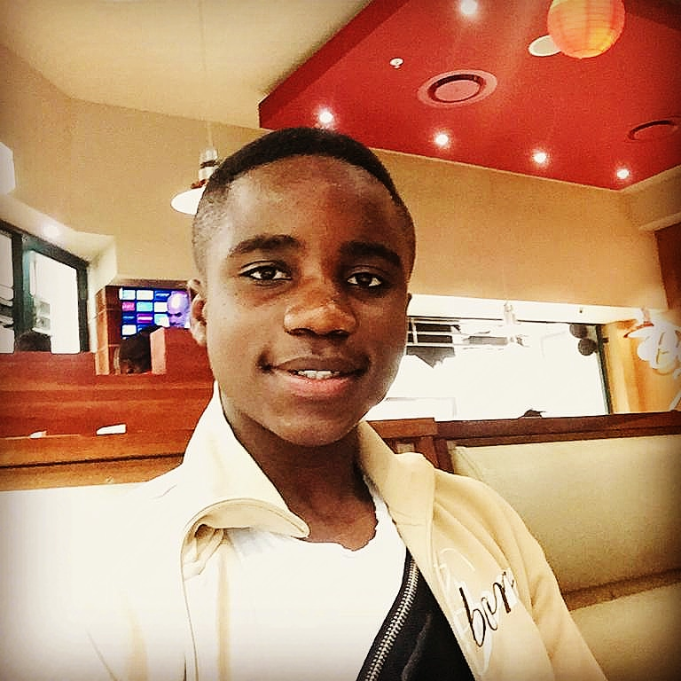

# Failure is an option here. if things are not falling then you are not innovating.- Elon Musk

# Hello there
Welcome to christian's official website, here you will learn about me and what I like doing.

# About Me

I enjoy working so hard in everything I do:smile: people describe me as a hard-working person who never stops in what I am going to do. one thing I believe is that if something has never been done that good, but that doesn't mean I have to follow what others thought of that thing to never hard been done. I am fascinated about the world around us and how thee is everyday change, I want to be part of this change in teaching others to be the change they can be.
I am currently a member at [the new york academy of sciences](https://www.nyas.org/about/our-mission/) as a member of [the junior academy](https://joinlaunchpad.com/#/profile/9670)
I also enjoy working on cultural programs so to know how to work better with people. *the new york academy of sciences* is one of the great places to do so. I also like doing researches about we should one day be living. I am also a member of **the space club**

School: [cape academy of mathematics, science & technology](https://www.camst.co.za/)

Grade: 10

Date of birth: 05-02-2004 (16years)

Live: South Africa

contact details
-
[facebook](https://www.facebook.com/chris.rama.798)

[twitter](https://www.twitter.com/Chrisrama6?s=09)

[linkedIn](https://www.lInkedin.com/in/christian-ramazani-aa3887183)

**Skills and Interests**

1) Aerospace 

2) Astronomy

3) Computer science

4) Education

5) Informatics

6) Sustainability Technology

7) Internet of Things

8) 4th industrial revolution,

9) Artificial intelligence

10) Entrepreneurship

11) STEM

# Languages
English 

French

Swahili

# HOBBIES

Likes watching science and tech shows

Reading Books

Building and Designing

Playing soccer

Riding skateboard

Playing batminton

Coding

# Project 

|    school                                 |  Outside project                           |
| ----------------------------------------- |  ----------------------------------------- |
| [Smart city made of cardboard](https://drive.google.com/file/d/1ynKtql6ab7-lJciYt3kYAnlRUjpfOkqP/view?usp=sharing)         |  arduino   [ 1](https://drive.google.com/file/d/1uNKUTdUuBgmzrF0Cgae2b_qCfhbyqY_U/view?usp=sharing)                               |
| [Hydraulic arm ](https://drive.google.com/file/d/1xrvltv6EerLTEQkAIlRiejifm5MjF9-v/view?usp=sharing)made of [cardboad](https://drive.google.com/file/d/1xyCF6pf-sk_eK4LVLAAhY40H1fC5u9vT/view?usp=sharing)        |  [BMI app]()                               |
| [nothing much yet]()                      |  [Iot smart home](https://docs.google.com/document/d/1aiE5mcFn9a48IBZ-sIUouPpg-2NthqTWoqIAM4UnPg8/edit?usp=sharing)                       |
| [Translating](https://docs.google.com/document/d/1d4usUGK55MC-fcPIZZqBeO_-SGAqTneN46NVZoyAqH4/edit?usp=sharing) [app]()                      |  [self-sustaining colony on the moon](https://drive.google.com/file/d/14YY6RQEwbb0PqExKxY1vgJjOk2gS3oaN/view?usp=sharing) |
| [nothing yet]()                      |  [intelligent Home and Health](https://drive.google.com/file/d/1EBKUjKYrPvsE17NhPt9R4A2B-yhBjraK/view?usp=sharing)          |
| [nothing yet]()                      |   [cybersecurity in the age of Iot]()       |
        

Accomplishment & Award
-
completed Level 2 English Language Course with [distinction](https://drive.google.com/file/d/1u00crgL7JOqDJQt-momrkaRH3oXKZkXt/view?usp=sharing) at scalabrini centre of cape town.

[First position](https://drive.google.com/file/d/1yBhKEyY_kStKL5W8FruV2V4bOaXZaYOj/view?usp=sharing) in Grade 7 Region 2 of [Metro Education District Mathematics Competition for primary schools](https://drive.google.com/file/d/1u2QTxLGrToQQMDF8mA3h34Fo-FViKDFS/view?usp=sharing).

Serve as [a Prefect at school](https://drive.google.com/file/d/1yZM7YOixloWPnddmL5Nc4adXvE9blyY7/view?usp=sharing).

[Top Achiever in Mathematics](https://drive.google.com/file/d/1te-EMaav_ioWbMmBEbMVkzKprV_6vy5E/view?usp=sharing )of the grade at school.

Pricincipal's [Award](https://drive.google.com/file/d/1y679CaVqOBjcXzEkY8Wz5cT6tSB0msdD/view?usp=sharing), for an [Examplary  and Outsanding Performance](https://drive.google.com/file/d/1yZM7YOixloWPnddmL5Nc4adXvE9blyY7/view?usp=sharing)

[Highest](https://drive.google.com/file/d/1ygX4WHXnciN_jdNp4CqzpCrJezJrY173/view?usp=sharing) Achiever in [the Grade](https://drive.google.com/file/d/1yaxAWeUrgKzltLI9AqPjS0WNB9q_uRk-/view?usp=sharing) (8)

Highest Achiever in [the grade]() (9)

Completed course on [App  for Mobile devices](https://drive.google.com/file/d/1rEYyAzltXd9uGzu_rs5KCuyxMNwCzvB9/view?usp=sharing) using APPInventor

completed Course on [Introduction to the internet of things](https://drive.google.com/file/d/1rFIFxg7mcI_N0PDdEs5T1EOrp6zOgs-s/view?usp=sharing)

Semifinalist on [BP global scholarship](https://afs.org/programs/stem-academy/)

Completeted a year as a [member New York Academy of Science](https://drive.google.com/file/d/1JAuVi-3-neN5liIvpOIsZF82-K1rhR8J/view?usp=sharing)

[MBRU community Immunity Ambassador](https://drive.google.com/file/d/1ruJ78-joMc6RsKQ3o2T5dqubFOgoG6Yw/view?usp=sharing)
[<iframe width="980" height="410" src=](https://staging-mars.nasa.gov/layout/embed/send-your-name/future/certificate/?cn=273191708626)" frameborder="0"></iframe>

# religious Practice 
Christian science is my Church. I am very religious person in everything I do

🚨 more coming up this Wednesday on #webday update 
